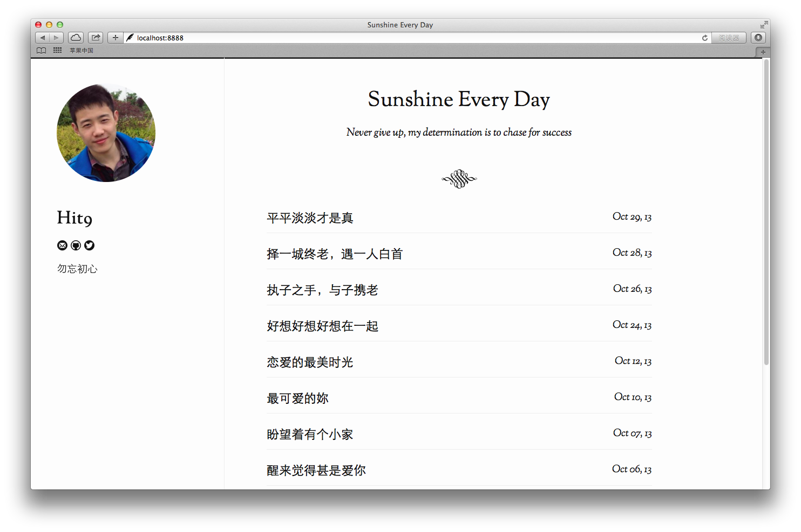

rux-theme-clr
=============

Another theme for [rux](https://github.com/hit9/rux)

Usage
-----

```bash
$ cd path/to/myblog
```
clone it or add it a submodule of your blog's repo:

```
git clone git://github.com/hit9/rux-theme-clr.git clr
```
or

```
git submodule add git://github.com/hit9/rux-theme-clr.git clr
```

Set `theme` to `clr`:

```toml
[blog]
theme = "clr"
```


And add this to `config.toml`:

```toml
[theme]
color = "#be005e"
```

Snapshots
---------




